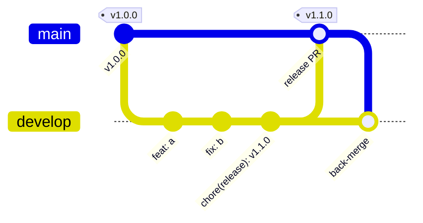

# Branching & Releasing

Lightweight `develop` → `main` model. **A release is a version bump on `main`.**
When a merge to `main` changes `package.json` to a version that has no tag yet,
`.github/workflows/release.yml` runs the test matrix, publishes to npm with
provenance, creates the `vX.Y.Z` git tag, and creates the GitHub Release. There
is no release branch, no manual `git tag`, and no Releases-UI step.

---

## 1. Branches

| Branch           | Base      | Merges into | Rule                                                                 |
| ---------------- | --------- | ----------- | ------------------------------------------------------------------- |
| `main`           | —         | —           | Released, stable code. **Protected. No direct pushes.** Only tags are cut here. |
| `develop`        | `main`    | `main`      | Integration branch. Default base for PRs. Always green.            |
| `feature/<slug>` | `develop` | `develop`   | A new capability or enhancement.                                   |
| `fix/<slug>`     | `develop` | `develop`   | A bug fix.                                                         |
| `docs/<slug>`    | `develop` | `develop`   | Docs / comments only.                                              |
| `chore/<slug>`   | `develop` | `develop`   | Tooling, deps, CI, refactor — no user-facing change.               |

**Exceptions**

- **Trivial, zero-risk change** (typo in a doc, comment): a PR straight into
  `main` is allowed. Fast-forward it into `develop` afterwards.
- **Urgent production fix**: branch `fix/<slug>` from **`main`**, PR into `main`,
  release a patch, then merge `main` back into `develop`.

**Merge style**

- `feature/*`, `fix/*`, `docs/*`, `chore/*` → `develop`: **squash-merge** (one
  Conventional Commit per PR).
- `develop` → `main`: **merge commit** (keeps both branch histories aligned).



---

## 2. Versioning ruleset (SemVer)

The public API is everything exported from `src/llm/index.ts`. Pick the bump by
the **most important** change in the release:

| Bump      | When                                                                                                          | Commit marker            |
| --------- | ----------------------------------------------------------------------------------------------------------- | ------------------------ |
| **major** `X+1.0.0` | Removed or renamed an export; changed a function signature, return shape, or default; dropped a Node version; any change that can break a caller. | `feat!:` / `fix!:` / `BREAKING CHANGE:` footer |
| **minor** `x.Y+1.0` | New capability, new provider adapter, new optional parameter or export — fully backward compatible.          | `feat:`                  |
| **patch** `x.y.Z+1` | Bug fix, performance fix with no API change, dependency bump, docs shipped in the package, internal refactor. | `fix:` / `perf:` / `docs:` / `chore:` / `refactor:` |

Rules:

- A release that contains **any** `feat!`/breaking change is a **major**, no
  matter what else is in it.
- Otherwise, if it contains **any** `feat` → **minor**.
- Otherwise → **patch**.
- Pre-`1.0.0` is over — do not use `0.x`. Breaking changes cost a major bump now.
- Never reuse or move a published version. Never publish from a dirty tree.

---

## 3. Cutting a release

Preconditions: `develop` is green and `## [Unreleased]` in `CHANGELOG.md` lists
everything in this release.

```bash
# 1. release-prep branch off develop
git checkout develop && git pull
git checkout -b chore/release-X.Y.Z

# 2. bump version (updates package.json + package-lock.json; no git tag)
npm version X.Y.Z --no-git-tag-version

# 3. CHANGELOG.md:
#    - rename "## [Unreleased]"  ->  "## [X.Y.Z] - YYYY-MM-DD"   (today)
#    - add a fresh empty "## [Unreleased]" above it
#    - update the link refs at the bottom:
#        [Unreleased]: .../compare/vX.Y.Z...HEAD
#        [X.Y.Z]:      .../releases/tag/vX.Y.Z

# 4. local gate
npm run verify

git commit -am "chore(release): vX.Y.Z"
git push -u origin chore/release-X.Y.Z
```

5. Open PR **`chore/release-X.Y.Z` → `develop`**, review, squash-merge.
6. Open PR **`develop` → `main`** titled `release: vX.Y.Z`. Wait for CI, then
   **merge commit**.

**That is the whole release.** You do not run `git tag` and you do not touch the
Releases UI. Merging step 6 changes `package.json` on `main`, which fires
`.github/workflows/release.yml` (see §4). Watch **Actions → Release**; when green,
confirm with `npm view llm-sdk-ts version`.

7. Back-merge so `develop` keeps the `main` history:

   ```bash
   git checkout develop && git pull
   git merge --no-ff main -m "chore: merge vX.Y.Z back into develop"
   git push
   ```

### Manual fallback

**Actions → Release → Run workflow** publishes whatever version is in
`package.json` on the chosen branch (and tags + releases it) — use it only to
re-run a release that half-failed.

---

## 4. What a version bump on `main` triggers

`.github/workflows/release.yml` runs when a push to `main` changes
`package.json` (or on manual dispatch):

1. **check** — reads `package.json` version `X.Y.Z`. If tag `vX.Y.Z` already
   exists, it stops here (a normal non-release merge does nothing).
2. **verify** — `npm ci` + `npm run verify` on Node 18, 20, 22.
3. **publish** —
   - requires a dated `## [X.Y.Z] - YYYY-MM-DD` section in `CHANGELOG.md`;
   - `npm publish --provenance --access public` with the `NPM_TOKEN` secret
     (skipped if that version is already on npm);
   - creates and pushes the `vX.Y.Z` git tag;
   - creates the GitHub Release, notes taken from that CHANGELOG section.

Every step is idempotent, so re-running a partly-failed release is safe.

The npm page's long description is the published `README.md`; its one-line
summary is `package.json` `"description"`. Both update on every publish.

---

## 5. One-time repo bootstrap → first release (v1.0.0)

`package.json` is already `1.0.0` and `CHANGELOG.md` already has
`## [1.0.0] - 2026-08-28`, so the first push to `main` *is* the first release.
The `NPM_TOKEN` secret and a public repo must exist **before** that push.

```bash
cd llm-sdk-ts

# 1. first commit
git add -A
git status                       # NO .env / dist / node_modules / generated-speech
git commit -m "chore: initial import — llm-sdk-ts 1.0.0"

# 2. create the PUBLIC repo (no push yet) and add the npm token
gh repo create shathiskannan/llm-sdk-ts --public --source . --remote origin
gh secret set NPM_TOKEN          # paste the npm granular token when prompted

# 3. push main  ->  Release workflow publishes 1.0.0, tags v1.0.0, makes the Release
git push -u origin main

# 4. create develop for all future work
git checkout -b develop
git push -u origin develop
```

Then on GitHub, one-time:

- **Settings → General → Default branch → `develop`**.
- **Settings → Branches → Add rule** for `main`: require a PR, require the `CI`
  status checks (Node 18 / 20 / 22), disallow direct pushes.

Confirm the release: `npm view llm-sdk-ts` and check **Releases** on GitHub.
